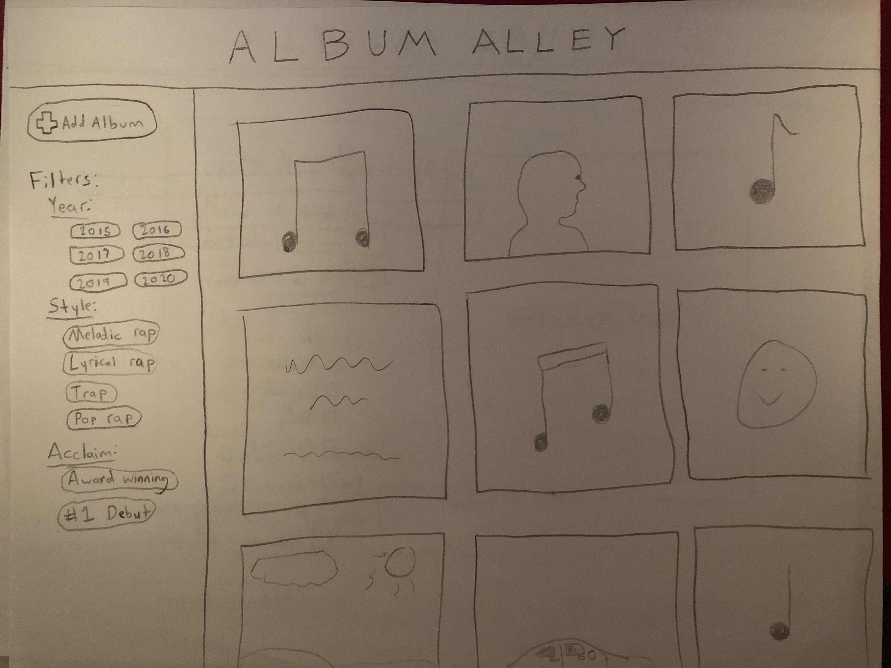
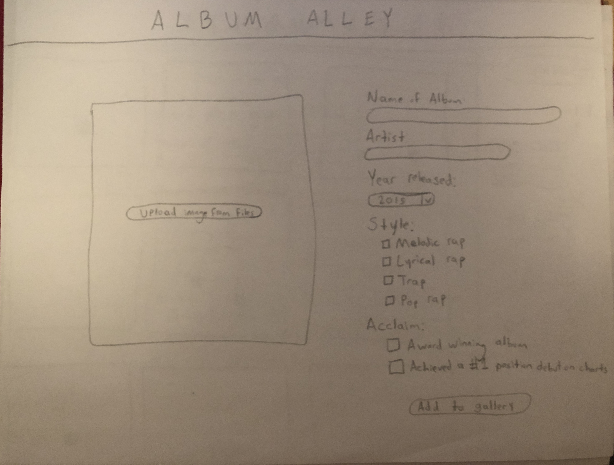
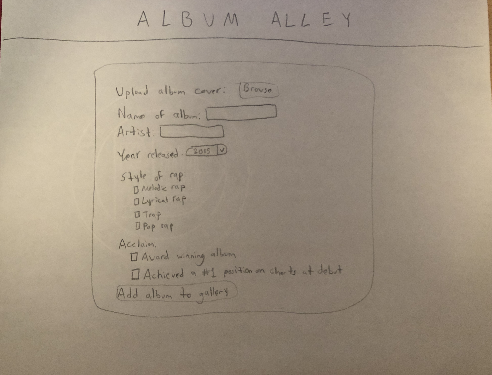
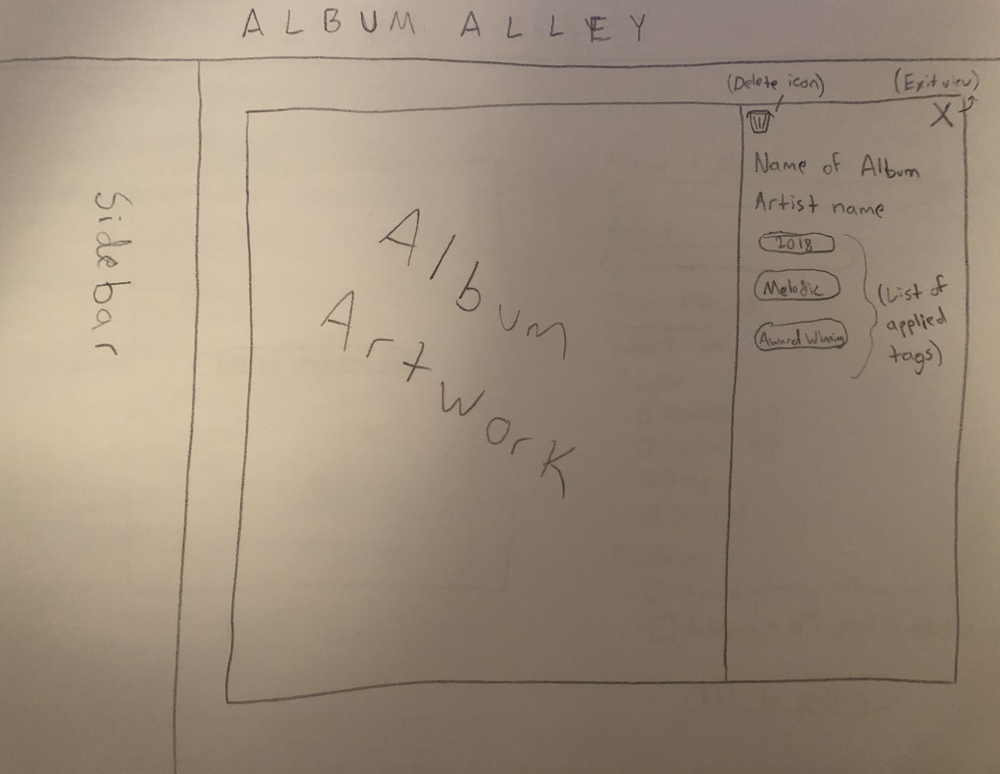
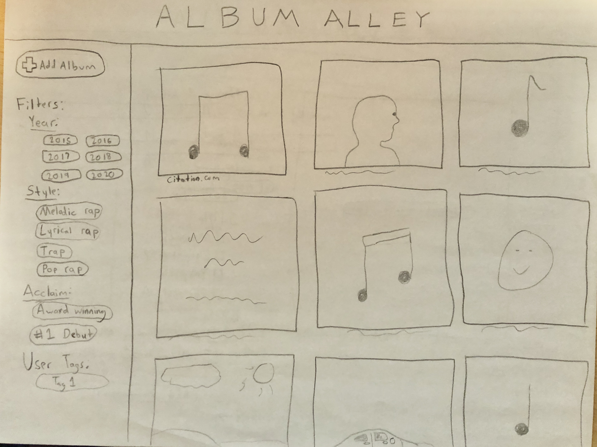
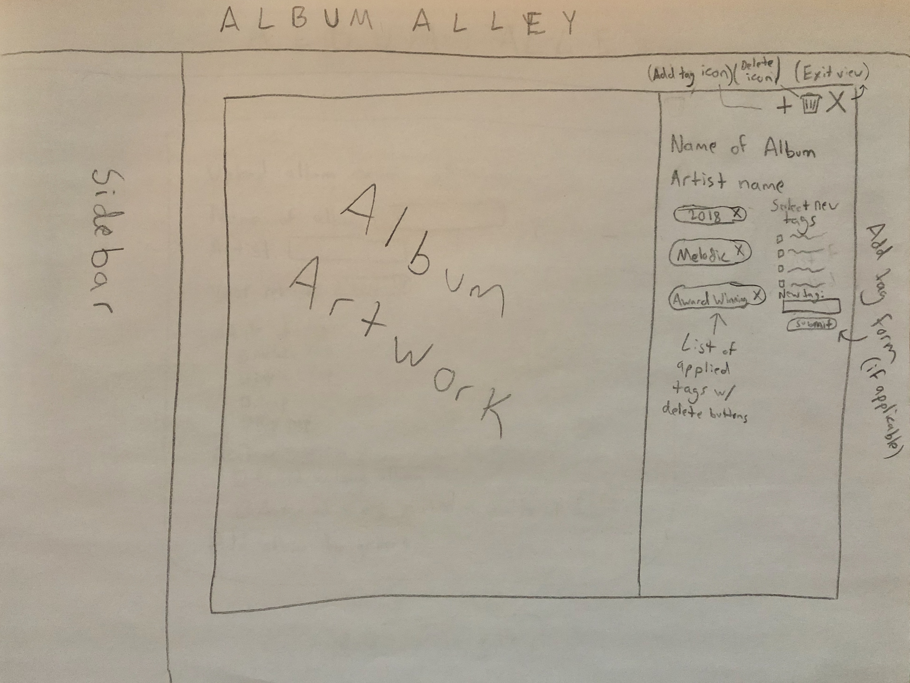
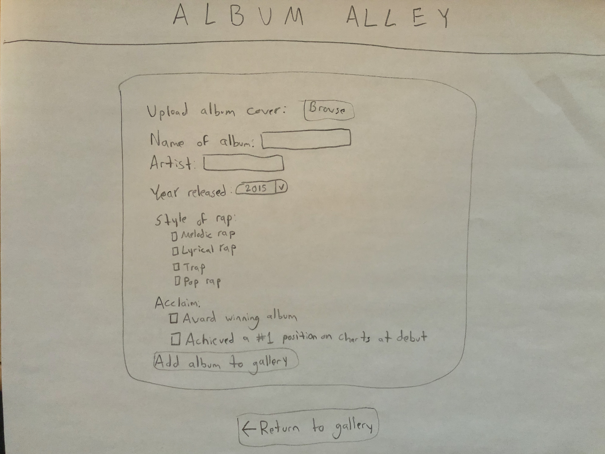

# Project 3: Design Journey

Be clear and concise in your writing. Bullets points are encouraged.

**Everything, including images, must be visible in VS Code's Markdown Preview.** If it's not visible in Markdown Preview, then we won't grade it.

# Design & Plan (Milestone 1)

## Describe your Gallery (Milestone 1)
> What will your gallery be about? 1 sentence.
 - My gallery will be a collection of hip hop/rap music albums, with additional details about each album.

> Will you be using your existing Project 1 or Project 2 site for this project? If yes, which project?
 - I will be creating a new website for this project.

> If using your existing Project 1 or Project 2, please upload sketches of your final design here.


## Target Audience(s) (Milestone 1)
> Tell us about your target audience(s).
 - My target audience will be hip hop/rap music fans eager to learn more about the music they like and compare it with other music. This will be a diverse audience, however will primarily consist of younger people, who are more tech-savvy.

## Design Process (Milestone 1)
> Document your design process. Show us the evolution of your design from your first idea (sketch) to design you wish to implement (sketch). Show us the process you used to organize content and plan the navigation (card sorting), if applicable.
> Label all images. All labels must be visible in VS Code's Markdown Preview.
> Clearly label the final design.










## Design Patterns (Milestone 1)
> Explain how your site leverages existing design patterns for image galleries.
> Identify the parts of your design that leverage existing design patterns and justify their usage.
> Most of your site should leverage existing patterns. If not, fully explain why your design is a special case (you need to have a very good reason here to receive full credit).
 - My site leverages existing patterns in several ways. First, it provides a full view of all images in the gallery in a scrollable grid view with limited text alongside those images. Second, images will be clickable such that a larger view of the image, more information, and options (including a delete button and an add tags button) appear when clicked on. Third, interactive features (i.e. adding or deleting a photo) will primarily be done using icon buttons rather than text "submit style" buttons in order to eliminate clutter and add to the visual appeal of the page.


## Requests (Milestone 1)
> Identify and plan each request you will support in your design.
> List each request that you will need (e.g. view image details, view gallery, etc.)
> For each request, specify the request type (GET or POST), how you will initiate the request: (form or query string param URL), and the HTTP parameters necessary for the request.

- Request: view photo details
  - Type: query string param URL
  - Params: images.id in DB

- Request: view gallery
  - Type: query string param URL
  - Params: images.id

- Request: add new photo & details, tag photo
  - Type: POST form
  - Params: images.file_name, tags.name

- Request: filter by tag
  - Type: query string param URL
  - Params: tags.name

- Request: delete photo
  - Type: query string param URL
  - Params: images.id, delete_image (boolean variable)

- Request: delete tag from photo
  - Type: query string param URL
  - Params: images.id, tags.id

- Request: display add tags form
  - Type: query string param URL
  - Params: images.id, add_tags (boolean variable)

- Request: add new/existing tag(s) to photo
  - Type: POST form
  - Params: images.id, tags.id


## Database Schema Design (Milestone 1)
> Plan the structure of your database. You may use words or a picture.
> Make sure you include constraints for each field.

> Hint: You probably need `images`, `tags`, and `image_tags` tables.

> Hint: For foreign keys, use the singular name of the table + _id. For example: `image_id` and `tag_id` for the `image_tags` table.

```
images (
  id : INTEGER {PK, U, Not, AI}
  file_name: TEXT {Not}
  file_ext: TEXT {Not}
  album_name: TEXT {Not}
  artist: TEXT {Not}
  source: TEXT {}
)

tags (
  id : INTEGER {PK, U, Not, AI}
  name: TEXT {U, Not}
)

image_tags (
  id : INTEGER {PK, U, Not, AI}
  tag_id: INTEGER {Not}
  image_id: INTEGER {Not}
)
```

## Database Query Plan (Milestone 1)
> Plan your database queries. You may use natural language, pseudocode, or SQL.
> Using your request plan above, plan all of the queries you need.

- Request: view photo details
   - Use JOIN statement to retrieve image id, extension, album name, and artist name (from images) and attached tags (from tags) through image_tags table

- Request: view gallery
   - Use SELECT statement to retrieve image ids and extensions of all uploaded images from images table

- Request: add new photo
  - Use multiple insert statements to
    - add file name to images
    - add image id and tag id(s) to image_tags

- Request: search/filter by tag
  - Use JOIN statement to retrieve ids of all images where an image's tag matches searched tag

- Request: delete photo
  - Use DELETE statements to delete entries on images, image_tags tables

- Request: get list of tags
  - Use SELECT statement to retrieve id's and/or names of all entries in tags table

- Request: get list of unused tags for add tag list
  - Use JOIN statement to retreive names of all tags where no relationship exists to image in image_tags table

- Request: add new tag(s) to existing photo
  - If user entered tag, use INSERT statement to enter tag name into tags, then complete following step
  - Use INSERT statement to enter tag id and image id into image_tags table

## Code Planning (Milestone 1)
> Plan what top level PHP pages you'll need.
 - index.php
 - add.php

> Plan what partials you'll need.
 - header.php

> Plan any PHP code you'll need.

  Form Validation/Input filtering:
  ```
    filter album name
    filter artist name
    filter year
    filter style of rap checkbox values
    filter acclaim checkbox values

    form is valid

    if no image uploaded, image is wrong file type, file is too big
      form invalid
      display feedback

    if album name is empty
      form invalid
      display feedback

    if artist name is empty
      form invalid
      display feedback

    if year is not from dropdown list
      form invalid
      display feedback

    if form is valid
      securely filter values as params for SQL
      attempt to insert values into DB
      if successful
        display message that data was added to gallery, offer return link to gallery page
      if failed
        display message that data has failed to be added, offer return link to gallery page
    ```

  Filtering by tag:
    ```
    function tag_filter($tag_name)
      Make DB request getting id for tag with name $tag_name
      Make DB request returning all image fields from table images who's tag corresponds to selected one on table image_tags
      Execute request
      return table with image details

    tag_filter($tag_name)
    ```

  Showing picture details:
    Upon click of an image:
      ```
      Get id number of image
      Use HTTP param to hide grid view, open details view
      retrieve album name, artist, and all associated tags from tables image, tags using image_tags
      display image, retrieved data, add tag button, delete button
      ```

  Adding new tag(s) to image:
    Upon click of an add button:
    ```
      Use HTTP param add_tags to echo post form for adding tags
    ```

    Adding tags
    ```
      Post form is submitted
      existing tags user wants to add are filtered, checked that values are in tags table
      all post variables placed in array
      if not null, new user typed tag filtered, check if it already exists
        sql query inserting new tag into tags
        added to tags array
      if tag in tags array is not null
        add all newly added tags with image id to image_tags using SQL query
      display image details page with all tags, including new ones
    ```

  Displaying images in gallery
    ```
    function print_image(image_id){
      insert image into formatted and styled div box
      if a seeded image, add citation below image
    }

    Send request to DB for selecting requested image_ids
    for id in image_ids:
      print_image(id)
    ```

  Displaying image tags on index.php:
    ```
    function print_tag(tag_id){
      print tag name into formatted and styled div box
    }

    Select all year tags from tags table
    for each id in year tag_ids:
      print_tag(id)

    Select all style tags from tags table
    for each id in style tag_ids:
      print_tag(id)

    Select all acclaim tags from tags table
    for each id in acclaim tag_ids:
      print_tag(id)

    Select all user tags from tags table
    for each id in user entered tag_ids:
      print_tag(id)
    ```


  Deleting an image:
    ```
    if a delete is requested
      get image_id of selected image
      remove related data from images, image_tags tables
      delete image from server with unlink()
      if successful
        display successfully deleted message
      else
        display failed to delete message
    ```

  Deleting a tag:
    ```
    if a tag deletion is requested
      get image_id of selected image, tag id of selected tag
      delete entry in image_tags linking the two
      display image details without updated tag list
    ```

  Displaying footer w/ citations:
    if on image details page
      if seeded image
        display footer with image citation and icons citations
      else
        display footer with icons citations

# Complete & Polished Website (Final Submission)

## Gallery Step-by-Step Instructions (Final Submission)
> Write step-by-step instructions for the graders.
> For each set of instructions, assume the grader is starting from index.php.

Viewing all images in your gallery:
1. All images are displayed on index.php
1a. if viewing image details, click the 'x' button at the top right to return to grid view

View all images for a tag:
1. Click the desired tag on the tags bar on the left

View a single image and all the tags for that image:
1. Click on the desired image

How to upload a new image:
1. Click "Add album" button on top of tags bar on the left
2. Fill out and submit the form on the add page (including the image upload)

How to delete an image:
1. Click on an image to view its details
2. Click the "trash" icon at the top of the details

How to view all tags at once:
1. All tags are displayed on the tags sidebar on index.php

How to add a tag to an existing image:
1. Click the "plus" icon at the top of an image's details
2. Select one or multiple from the existing tags checklist and/or type in your own new tag
3. Submit the form

How to remove a tag from an existing image:
1. Click on the desired image
2. Click the "x" icon attached to the desired tag under image details


## Reflection (Final Submission)
> Take this time to reflect on what you learned during this assignment. How have you improved since starting this class?
 - In completing this assignment, I've learned quite a few things. I've further developed my SQL skills, expanding into using DELETE, JOIN, and UPDATE statements. I've also learned more about sorting data into different tables, managing the relationship between those tables, and how to implement each of those tables into a coherent website. One more thing I've learned about is the process of uploading an image to a server, from the HTML side to its storage location in the server. Lastly, this project has helped me learn a lot about creating and utilizing HTTP query strings.
 - Overall, since I began this class, I've come a long way in my web programming skills. I've added basic PHP and SQL to my coding repitoire, enhanced my knowledge of design principles, and, perhaps most importantly, gotten a better understanding of web security and how to implement more secure sites and forms. I look forward to using these skills as I progress in college and into my career.
